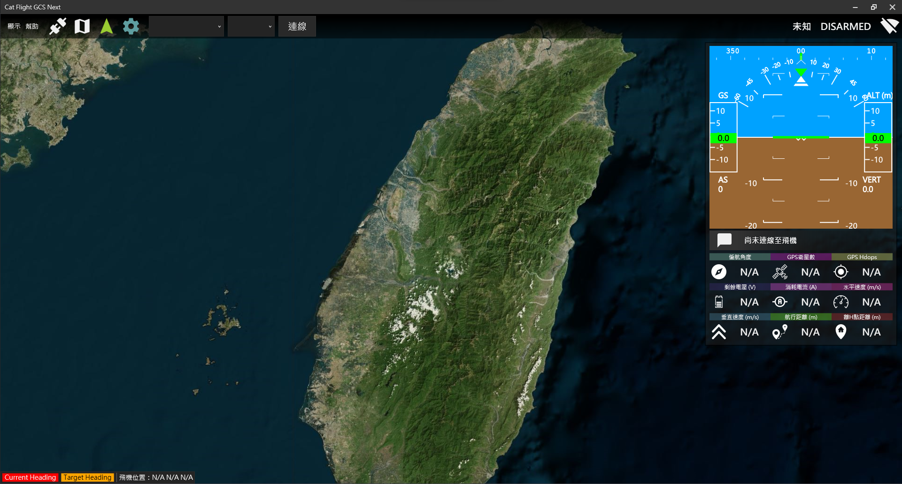
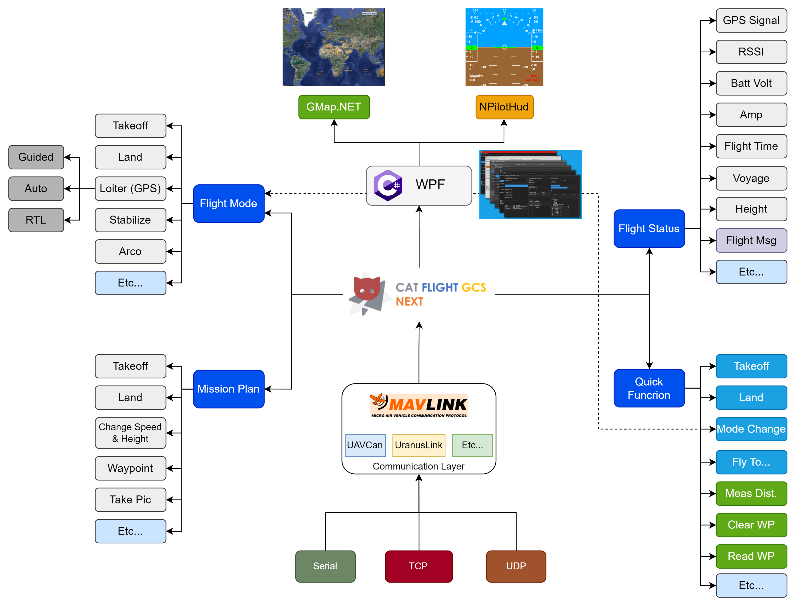

<center>
    
    <h6>A UAV Ground Control Software That Running On Windows System. Use .Net 6 WPF To Implement.</h6>
</center>



# Structure


# Prerequires
- [Visual Studio 2022](https://visualstudio.microsoft.com/vs/)
  - .NET Desktop development

# Build
1. Clone This Project, Then Open .sln File.
```bash
git clone https://github.com/minexo79/CatFlightGCSNext.git
```
2. Right Click Solution Name -> Restore Nuget Package.
3. Click Build (Green Play Button) / Build Option in Right Click Menu by Solution Name.
4. Enjoy~

# Depends
- [GMap.NET](https://github.com/judero01col/GMap.NET)
- [WPFDarkTheme](https://github.com/AngryCarrot789/WPFDarkTheme)
- [NPilotHud](https://github.com/nirex0/NPilotHud)
- [Mavlink](https://github.com/ArduPilot/pymavlink)

# Reference
- [MissionPlanner](https://github.com/ArduPilot/MissionPlanner)
- [Mission Planner Wiki](https://ardupilot.org/planner/)
- [MP地面站二次開發 - Bilibili](https://www.bilibili.com/video/BV1mg411N7mq/)